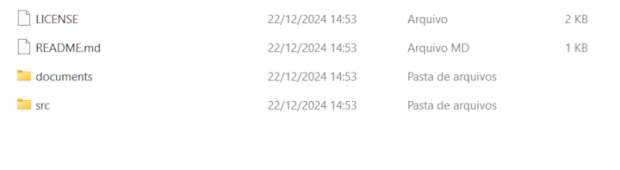

# race in terminal
projeto em desenvolvimento

## Como executar
### 1. Baixar o projeto ⬇️
- você pode baixar o .zip do projeto clicando [aqui](https://github.com/kei4ss/race-in-terminal/archive/refs/heads/main.zip).

### 2. Abrindo arquivo
- Após baixar, você pode extrair os arquivos para um local do seu agrado.
- Ao entrar dentro da pasta do projeto, você verá algo parecido com a foto abaixo

- acesse a pasta src